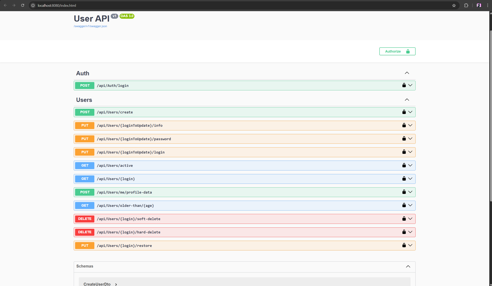
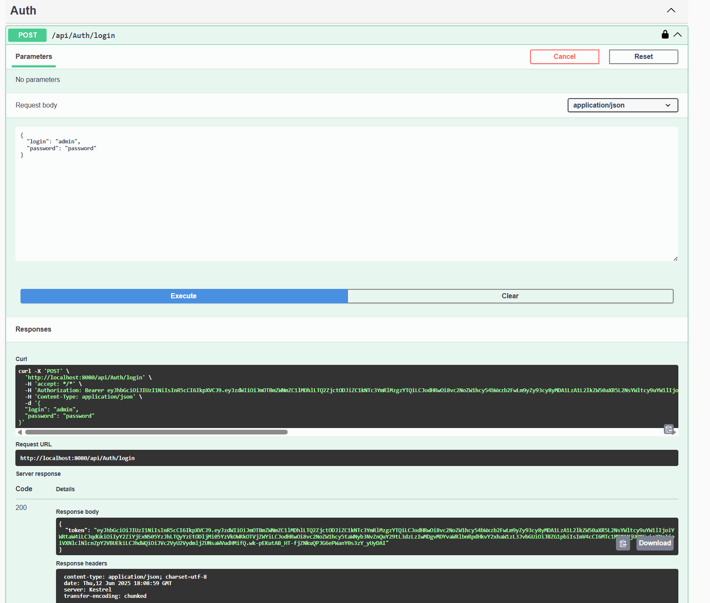
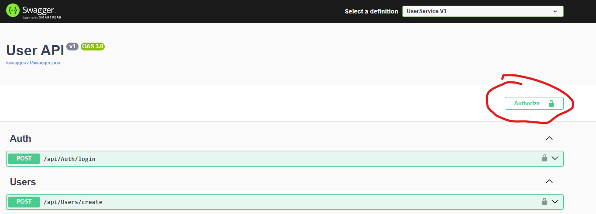
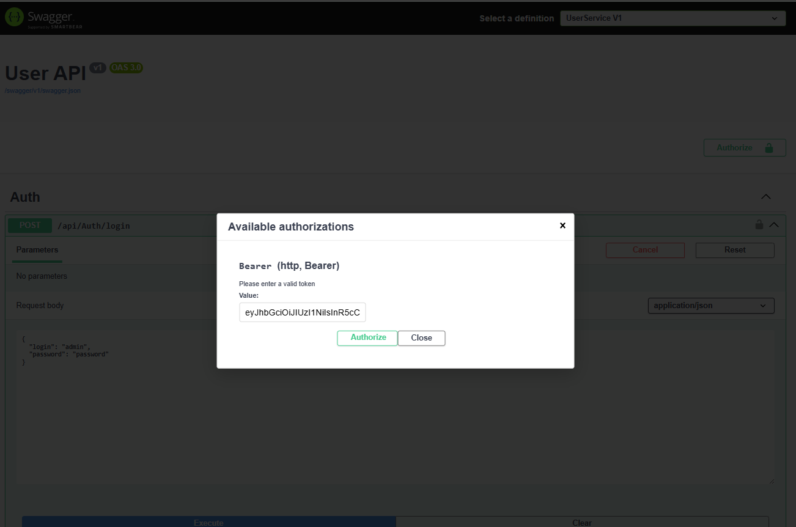

# UserService: Web API для управления пользователями на .NET 9

Это REST API сервис, разработанный на **.NET 9** и **ASP.NET Core**, для комплексного управления пользователями. Проект реализует CRUD-операции, аутентификацию на основе JWT-токенов и ролевую модель доступа (пользователь и администратор).

Сервис полностью контейнеризирован с помощью **Docker** и легко разворачивается вместе с базой данных **PostgreSQL** через `docker-compose`.



---

## 🚀 Ключевые возможности

- **Аутентификация и авторизация:** Безопасный вход в систему с использованием JWT-токенов.
- **Ролевая модель:** Четкое разделение прав между обычными пользователями и администраторами.
- **Полный цикл CRUD:** Создание, чтение, обновление и удаление пользователей.
- **Гибкое удаление:** Поддержка как полного (`hard delete`), так и мягкого (`soft delete`) удаления.
- **Продвинутые запросы:** Фильтрация пользователей по возрасту, получение только активных пользователей.
- **Валидация данных:** Встроенная проверка данных на уровне домена (например, формат логина и пароля).
- **Контейнеризация:** Готовые `Dockerfile` и `docker-compose.yml` для быстрого и изолированного запуска.
- **Автоматическое создание БД:** Миграции Entity Framework Core применяются при старте, а база данных наполняется начальными данными (создается пользователь `admin`).
- **Централизованная обработка ошибок:** Кастомное middleware для формирования понятных и стандартизированных ответов при ошибках.

---

## 🛠️ Стек технологий

| Категория         | Технологии |
|------------------|------------|
| Бэкенд           | .NET 9, ASP.NET Core Web API |
| База данных      | PostgreSQL |
| ORM              | Entity Framework Core |
| Аутентификация   | JSON Web Tokens (JWT) |
| Контейнеризация  | Docker, Docker Compose |
| Архитектура      | Многоуровневая архитектура (Domain, Application, Infrastructure, API) |

---

## ⚙️ Как запустить проект

Проект спроектирован для запуска в **Docker**. Это самый простой и надежный способ.

### Предварительные требования

- Установленный и запущенный **Docker**

### Шаги для запуска

1. **Клонируйте репозиторий:**
```bash
git clone https://github.com/P4r4cosm/UserService
cd UserService
```

2. **Настройка окружения (опционально):**

   В файле `docker-compose.yml` уже прописаны все необходимые переменные окружения. Для дополнительной безопасности, особенно для `Jwt:Key`, вы можете создать файл `.env` в корневой директории проекта и переопределить переменные там:

   ```env
   # Генерируйте свой собственный длинный и сложный ключ
   JWT_KEY=MySuperSecretAndExtraLongKeyForDevelopment12345
   JWT_ISSUER=MyProjectAPI
   JWT_AUDIENCE=MyProjectClient
   ```

3. **Сборка и запуск контейнеров:**

   Откройте терминал в корневой папке проекта и выполните команду:
   ```bash
   docker-compose up -d --build
   ```

   Эта команда:
   - Соберет Docker-образ для API (`user_service_api`)
   - Скачает образ PostgreSQL (`user_service_postgres`)
   - Запустит оба контейнера в фоновом режиме
   - Создаст общую сеть для взаимодействия контейнеров

4. **Проверка:**

   - API будет доступен по адресу: [http://localhost:8080](http://localhost:8080)
   - Интерактивная документация Swagger UI: [http://localhost:8080](http://localhost:8080)

   При первом запуске автоматически применятся миграции и будет создан пользователь-администратор:
   - **Логин:** `admin`
   - **Пароль:** `password`

---

## 🏗️ Архитектура проекта

Проект имеет четкую многоуровневую структуру, что упрощает его поддержку и расширение.

```
/
├── API/                    # Слой представления (контроллеры, middleware, запуск)
├── Application/            # Слой приложения (логика, DTO, сервисы)
├── Domain/                 # Слой домена (сущности, интерфейсы репозиториев)
├── PostgresInfrastructure/ # Слой инфраструктуры (реализация репозиториев, DbContext)
├── docker-compose.yml      # Файл для оркестрации контейнеров
└── Dockerfile              # Файл для сборки образа API
```

---

## 🔑 Аутентификация и использование API

Все защищенные эндпоинты требуют Bearer токен в заголовке `Authorization`.

### Как получить токен:

1. Откройте [Swagger](http://localhost:8080)
2. Найдите эндпоинт `POST /api/auth/login`
3. Нажмите "Try it out" и введите учетные данные администратора (`admin/password`) в тело запроса.
4. Выполните запрос. В ответе вы получите JWT токен.



---

### Как использовать токен:

1. В Swagger нажмите на кнопку **"Authorize"** в правом верхнем углу.
2. Вставьте полученный токен в формате `Bearer {ваш_токен}`.
3. Нажмите **"Authorize"**. Теперь все ваши запросы к защищенным эндпоинтам будут автоматически включать этот токен.




---

## 📖 Документация по API эндпоинтам

Полный список эндпоинтов доступен в **Swagger**. Ниже приведено краткое описание.

### AuthController

- `POST /api/auth/login` — Аутентифицирует пользователя и возвращает JWT токен.  
  **Доступ:** Публичный

### UsersController

- `POST /api/users/create` — Создает нового пользователя  
  **Доступ:** Администратор
- `PUT /api/users/{loginToUpdate}/info` — Обновляет имя, пол или дату рождения  
  **Доступ:** Администратор или владелец аккаунта
- `PUT /api/users/{loginToUpdate}/password` — Меняет пароль  
  **Доступ:** Администратор или владелец аккаунта
- `PUT /api/users/{loginToUpdate}/login` — Меняет логин  
  **Доступ:** Администратор или владелец аккаунта
- `GET /api/users/active` — Возвращает список всех активных пользователей  
  **Доступ:** Администратор
- `GET /api/users/{login}` — Получает детальную информацию о пользователе  
  **Доступ:** Администратор
- `POST /api/users/me/profile-data` — Запрашивает данные своего профиля с подтверждением текущего пароля  
  **Доступ:** Владелец аккаунта
- `GET /api/users/older-than/{age}` — Возвращает список пользователей старше указанного возраста  
  **Доступ:** Администратор
- `DELETE /api/users/{login}/soft-delete` — Мягко удаляет пользователя (помечает как неактивного)  
  **Доступ:** Администратор
- `DELETE /api/users/{login}/hard-delete` — Полностью удаляет пользователя из БД  
  **Доступ:** Администратор
- `PUT /api/users/{login}/restore` — Восстанавливает мягко удаленного пользователя  
  **Доступ:** Администратор